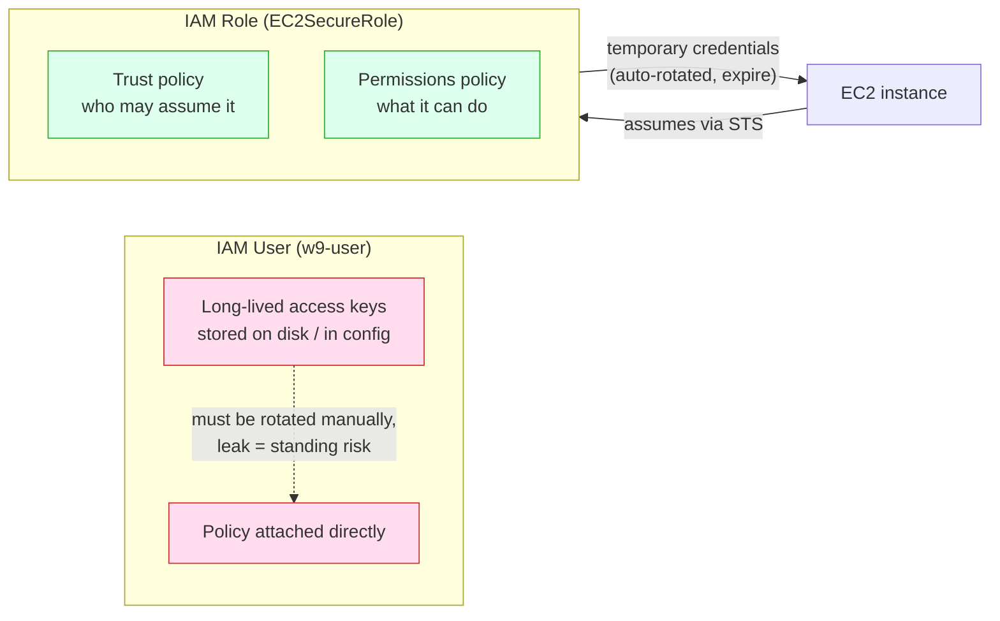
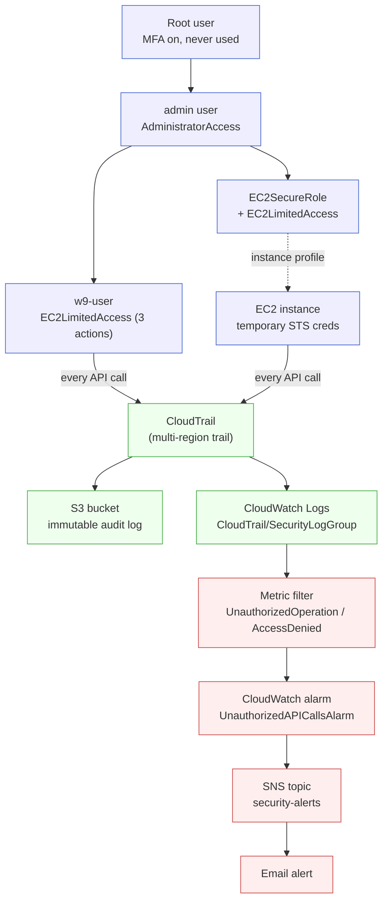

# DOCUMENTATION

Week 9 stands up a small but complete cloud-security baseline in an AWS Free Tier account: a clean IAM
structure (root locked down, an admin user, a low-privilege `w9-user`), a least-privilege custom policy,
an IAM role for EC2, account-wide audit logging with CloudTrail, and an automated email alert that fires on
unauthorized API calls. Everything is region-scoped to `ap-southeast-1` (Singapore), matching Week 7.

Every command below is run against your own AWS account with your own AWS CLI credentials. The repository
only holds the static artifacts the commands reference:

```
w9/
  ec2-limited-policy.json        least-privilege EC2 policy (3 actions)
  ec2-trust.json                 trust policy: EC2 service may assume a role
  cloudtrail-bucket-policy.json  S3 bucket policy letting CloudTrail write logs
  cloudtrail-cwl-trust.json      trust policy: CloudTrail may assume a role
  cloudtrail-cwl-permissions.json that role's permission to write log events
  DOCS.md                        this guide
```

> **Free Tier cost note.** CloudTrail's first management-event trail, IAM, SNS, and CloudWatch alarms are
> free or effectively free at this scale, but the S3 bucket holding the trail and the CloudWatch Logs group
> accrue tiny storage charges over time. [Section VIII](#viii-cleanup) tears everything down — do it when you
> finish so nothing lingers.

## Quick Start

For anyone with the repo who wants to reproduce the setup. There is nothing to "run" locally — the artifacts
are applied against a live AWS account.

Prerequisites:

- An AWS Free Tier account with **MFA enabled on the root user** and an **IAM admin user** for daily work
  (see [Section I](#i-iam-fundamentals-day-1)).
- The AWS CLI installed and configured **as the admin user** (never as root):

```powershell
aws configure          # access key, secret, region = ap-southeast-1, output = json
aws sts get-caller-identity
```

`get-caller-identity` returns the ARN of whoever the CLI is acting as. Confirm it ends in
`:user/<your-admin-user>` and **not** `:root` before running anything else.

The remaining sections (II–VI) are run in order; each substitutes your real 12-digit account ID where the
artifacts and commands show `<ACCOUNT_ID>`. Find it with:

```powershell
aws sts get-caller-identity --query Account --output text
```

## I. IAM Fundamentals

IAM (Identity and Access Management) is how AWS decides *who* can do *what*. Four building blocks:

| Component  | What it is                                                                                  |
| ---------- | ------------------------------------------------------------------------------------------- |
| **User**   | A long-lived identity for a person or app. Has a password and/or long-lived access keys.     |
| **Group**  | A bucket of users; policies attached to the group apply to every member. Eases management.   |
| **Role**   | An identity with **no** long-lived credentials, *assumed* temporarily by a user or service. |
| **Policy** | A JSON document listing allowed/denied actions. Attached to users, groups, or roles.         |

**The root user is special and dangerous.** It can do anything, including closing the account, and its access
cannot be restricted by IAM policies. Best practice is to lock it away and never use it day to day.

### Step 1 — Enable MFA on root (Console)

Sign in as root → top-right account menu → **Security credentials** → **Multi-factor authentication (MFA)**
→ **Assign MFA device** → register an authenticator app (e.g. Google Authenticator) → confirm two codes.

### Step 2 — Create an admin IAM user (Console)

**IAM** → **Users** → **Create user** → name it (e.g. `admin`) → attach the AWS-managed
`AdministratorAccess` policy → create access keys → run `aws configure` with those keys. From here on, the
root user is untouched.

### Step 3 — Create a low-privilege `w9-user` (CLI, as admin)

```powershell
aws iam create-user --user-name w9-user
```

Attach a starter managed policy giving read-only EC2 access:

```powershell
aws iam attach-user-policy `
  --user-name w9-user `
  --policy-arn arn:aws:iam::aws:policy/AmazonEC2ReadOnlyAccess
```

Verify:

```powershell
aws iam list-attached-user-policies --user-name w9-user
```

**Result:** The account now has three tiers — root (locked, MFA-protected, unused), `admin` (daily work),
and `w9-user` (read-only EC2). `list-attached-user-policies` shows `AmazonEC2ReadOnlyAccess` on
`w9-user`.

## II. Least-Privilege Custom Policy

**Least privilege** means granting only the permissions actually needed — no more. `AmazonEC2ReadOnlyAccess`
allows *every* read action across EC2 (and a lot of `Describe*` on related services). If a user only needs
to start, stop, and list instances, that managed policy is far too broad. We replace it with a custom policy
allowing exactly three actions.

File: `w9/ec2-limited-policy.json`

```json
{
  "Version": "2012-10-17",
  "Statement": [
    {
      "Effect": "Allow",
      "Action": [
        "ec2:StartInstances",
        "ec2:StopInstances",
        "ec2:DescribeInstances"
      ],
      "Resource": "*"
    }
  ]
}
```

Create the policy and capture its ARN:

```powershell
aws iam create-policy `
  --policy-name EC2LimitedAccess `
  --policy-document file://ec2-limited-policy.json
```

Swap the broad managed policy for the tight custom one:

```powershell
# detach the wide-open read-only policy
aws iam detach-user-policy `
  --user-name w9-user `
  --policy-arn arn:aws:iam::aws:policy/AmazonEC2ReadOnlyAccess

# attach the least-privilege policy (use the ARN create-policy returned)
aws iam attach-user-policy `
  --user-name w9-user `
  --policy-arn arn:aws:iam::<ACCOUNT_ID>:policy/EC2LimitedAccess
```

**Why is this least privilege?** `w9-user` can do precisely three things to EC2 instances and nothing else —
no creating, terminating, modifying, or touching other services. If those credentials leak, the blast radius
is start/stop/describe on EC2 instead of read access to the entire EC2 surface. The set of allowed actions
maps one-to-one to the job, which is the definition of least privilege.

> `Resource: "*"` here means "any instance." A stricter version would scope `Resource` to specific instance
> ARNs or use tag conditions, narrowing *which* instances can be touched as well as *what* can be done.

**Result:** `aws iam list-attached-user-policies --user-name w9-user` now shows only `EC2LimitedAccess`.

## III. IAM Roles for EC2

A **role** carries permissions but has no permanent credentials. Instead, a trusted principal *assumes* it and
receives short-lived credentials from STS (Security Token Service). This is the preferred way to give an EC2
instance permissions: you attach a role to the instance and AWS rotates temporary credentials automatically —
no access keys to store on disk, leak, or rotate.

The **trust policy** says *who* may assume the role. Here, the EC2 service itself.

File: `w9/ec2-trust.json`

```json
{
  "Version": "2012-10-17",
  "Statement": [
    {
      "Effect": "Allow",
      "Principal": { "Service": "ec2.amazonaws.com" },
      "Action": "sts:AssumeRole"
    }
  ]
}
```

Create the role, then attach the same least-privilege policy from Section II:

```powershell
aws iam create-role `
  --role-name EC2SecureRole `
  --assume-role-policy-document file://ec2-trust.json

aws iam attach-role-policy `
  --role-name EC2SecureRole `
  --policy-arn arn:aws:iam::<ACCOUNT_ID>:policy/EC2LimitedAccess
```

To actually use it, the role is wrapped in an **instance profile** and attached to an EC2 instance:

```powershell
aws iam create-instance-profile --instance-profile-name EC2SecureProfile
aws iam add-role-to-instance-profile `
  --instance-profile-name EC2SecureProfile --role-name EC2SecureRole
# then: aws ec2 associate-iam-instance-profile --instance-id <id> --iam-instance-profile Name=EC2SecureProfile
```

### User vs Role



| Aspect          | User                                   | Role                                          |
| --------------- | -------------------------------------- | --------------------------------------------- |
| Credentials     | Long-lived keys/password               | Temporary, auto-expiring STS tokens           |
| Used by         | People, on-prem apps                   | AWS services (EC2/Lambda), federated/cross-acct |
| Leak risk       | High — keys are valid until rotated    | Low — tokens expire in minutes/hours          |
| Rotation        | Manual                                 | Automatic                                      |

**Result:** `aws iam get-role --role-name EC2SecureRole` returns the role with its trust policy, and
`list-attached-role-policies` shows `EC2LimitedAccess`.

## IV. CloudTrail Monitoring

CloudTrail records API activity across the account — who called what, from where, and whether it succeeded.
It is the audit log that makes the alert in Section V possible. A trail delivers events to an S3 bucket.

### Step 1 — Create the S3 bucket

Bucket names are globally unique. Pick something like `security-trail-<ACCOUNT_ID>`.

```powershell
aws s3api create-bucket `
  --bucket security-trail-<ACCOUNT_ID> `
  --region ap-southeast-1 `
  --create-bucket-configuration LocationConstraint=ap-southeast-1
```

### Step 2 — Authorize CloudTrail to write to the bucket

**This step is what the raw command set omits — `create-trail` fails without it.** The bucket needs a policy
granting the CloudTrail service `s3:GetBucketAcl` and `s3:PutObject`. Edit `cloudtrail-bucket-policy.json`,
replacing `<BUCKET_NAME>` and `<ACCOUNT_ID>` with your values, then apply it:

```powershell
aws s3api put-bucket-policy `
  --bucket security-trail-<ACCOUNT_ID> `
  --policy file://cloudtrail-bucket-policy.json
```

### Step 3 — Create and start the trail

```powershell
aws cloudtrail create-trail `
  --name security-trail `
  --s3-bucket-name security-trail-<ACCOUNT_ID> `
  --is-multi-region-trail

aws cloudtrail start-logging --name security-trail
```

`--is-multi-region-trail` captures activity in *every* region, not just `ap-southeast-1` — important, because
an attacker may operate in a region you don't normally use. Confirm logging is on:

```powershell
aws cloudtrail get-trail-status --name security-trail --query IsLogging
```

CloudTrail now records failed logins, unauthorized API calls, and role misuse. Logs land in S3 under
`AWSLogs/<ACCOUNT_ID>/CloudTrail/...` as gzipped JSON (allow ~5–15 minutes for the first delivery).

### Example event (denied call)

```json
{
  "eventVersion": "1.09",
  "userIdentity": { "type": "IAMUser", "userName": "w9-user" },
  "eventTime": "2026-06-13T08:21:44Z",
  "eventSource": "ec2.amazonaws.com",
  "eventName": "RunInstances",
  "awsRegion": "ap-southeast-1",
  "errorCode": "Client.UnauthorizedOperation",
  "errorMessage": "You are not authorized to perform this operation.",
  "readOnly": false,
  "managementEvent": true
}
```

The `errorCode` field is the signal the alarm in Section V watches for.

**Result:** `get-trail-status` reports `IsLogging: true`, and within minutes the S3 bucket contains
CloudTrail log objects.

## V. Alerting on Unauthorized Access

The goal: an email whenever someone attempts an action they are not allowed to perform. The chain is
**CloudTrail → CloudWatch Logs → metric filter → alarm → SNS → email**.

> **Why the extra wiring?** Metric filters scan a **CloudWatch Logs** log group, not S3. CloudTrail does not
> send to CloudWatch Logs by default — you must give it a log group *and* a role allowing it to write there.
> The raw `put-metric-filter` command assumes this is already done.

### Step 1 — Create the log group

```powershell
aws logs create-log-group --log-group-name CloudTrail/SecurityLogGroup
```

### Step 2 — Create the role CloudTrail uses to write logs

```powershell
aws iam create-role `
  --role-name CloudTrailToCloudWatchLogs `
  --assume-role-policy-document file://cloudtrail-cwl-trust.json
```

Attach the write permission (edit `cloudtrail-cwl-permissions.json` to insert your `<ACCOUNT_ID>` first):

```powershell
aws iam put-role-policy `
  --role-name CloudTrailToCloudWatchLogs `
  --policy-name CloudTrailLogsWrite `
  --policy-document file://cloudtrail-cwl-permissions.json
```

### Step 3 — Point the trail at the log group

```powershell
aws cloudtrail update-trail `
  --name security-trail `
  --cloud-watch-logs-log-group-arn arn:aws:logs:ap-southeast-1:<ACCOUNT_ID>:log-group:CloudTrail/SecurityLogGroup:* `
  --cloud-watch-logs-role-arn arn:aws:iam::<ACCOUNT_ID>:role/CloudTrailToCloudWatchLogs
```

### Step 4 — Create the SNS topic and subscribe your email

```powershell
aws sns create-topic --name security-alerts

aws sns subscribe `
  --topic-arn arn:aws:sns:ap-southeast-1:<ACCOUNT_ID>:security-alerts `
  --protocol email `
  --notification-endpoint your-email@example.com
```

Check your inbox and **click the confirmation link** — SNS will not deliver until the subscription is confirmed.

### Step 5 — Metric filter for unauthorized calls

```powershell
aws logs put-metric-filter `
  --log-group-name CloudTrail/SecurityLogGroup `
  --filter-name UnauthorizedAPICalls `
  --filter-pattern '{ ($.errorCode = "*UnauthorizedOperation") || ($.errorCode = "AccessDenied*") }' `
  --metric-transformations metricName=UnauthorizedAPICalls,metricNamespace=SecurityMetrics,metricValue=1
```

### Step 6 — Alarm that notifies SNS

```powershell
aws cloudwatch put-metric-alarm `
  --alarm-name UnauthorizedAPICallsAlarm `
  --metric-name UnauthorizedAPICalls `
  --namespace SecurityMetrics `
  --statistic Sum `
  --period 300 `
  --threshold 1 `
  --comparison-operator GreaterThanOrEqualToThreshold `
  --evaluation-periods 1 `
  --treat-missing-data notBreaching `
  --alarm-actions arn:aws:sns:ap-southeast-1:<ACCOUNT_ID>:security-alerts
```

### Step 7 — Test it

Configure a second CLI profile with `w9-user`'s keys and attempt something it cannot do:

```powershell
# as w9-user — denied, because the least-privilege policy allows only start/stop/describe
aws ec2 create-key-pair --key-name nope --profile w9-user
```

The call is denied, CloudTrail logs it with an `UnauthorizedOperation`/`AccessDenied` error code, the metric
filter increments `UnauthorizedAPICalls`, the alarm crosses its threshold, and SNS emails you. End-to-end this
takes a few minutes (log delivery + the 5-minute alarm period).

**Result:** Attempting a restricted action produces an email alert within minutes.

## VI. Security Hardening & Review

A short audit pass tightening the account.

### Remove unused IAM users

```powershell
aws iam list-users --query "Users[].UserName"
# for any user you no longer need, detach policies/keys first, then:
# aws iam delete-user --user-name <name>
```

### Rotate / deactivate access keys

Long-lived keys should be rotated regularly and deactivated when unused:

```powershell
aws iam list-access-keys --user-name w9-user
# aws iam update-access-key --user-name w9-user --access-key-id <id> --status Inactive
# create a fresh key, update the consumer, then delete the old one:
# aws iam delete-access-key --user-name w9-user --access-key-id <old-id>
```

### Enforce a strong password policy

```powershell
aws iam update-account-password-policy `
  --minimum-password-length 12 `
  --require-symbols `
  --require-numbers `
  --require-uppercase-characters `
  --require-lowercase-characters
```

### Enable IAM Access Analyzer

Access Analyzer flags resources (roles, buckets, keys) shared outside the account:

```powershell
aws accessanalyzer create-analyzer `
  --analyzer-name account-analyzer `
  --type ACCOUNT
aws accessanalyzer list-findings --analyzer-arn <analyzer-arn-from-create>
```

### Incident-response steps (runbook)

1. **Detect** — the SNS email from Section V, or a finding in Access Analyzer / CloudTrail.
2. **Contain** — deactivate the offending access keys (`update-access-key ... --status Inactive`); detach
   permissions from the principal.
3. **Investigate** — query CloudTrail / the CloudWatch log group for the principal's recent activity and the
   source IP.
4. **Eradicate & recover** — rotate credentials, delete rogue users/roles, restore least-privilege policies.
5. **Review** — tighten the policy or add a metric filter so the same gap alarms next time.

**Result:** Password policy enforced, unused users removed, keys rotated/deactivated, Access Analyzer running.

## VII. Security Architecture

The whole Week 9 baseline in one picture: a locked-down identity tier feeding a least-privilege policy and an
EC2 role, with every API call audited and unauthorized ones routed to an email alert.



## VIII. Cleanup

Tear everything down in reverse order so nothing accrues charges. Substitute your `<ACCOUNT_ID>` /
`<BUCKET_NAME>` throughout.

```powershell
# --- Alerting (Section V) ---
aws cloudwatch delete-alarms --alarm-names UnauthorizedAPICallsAlarm
aws logs delete-metric-filter --log-group-name CloudTrail/SecurityLogGroup --filter-name UnauthorizedAPICalls
aws sns delete-topic --topic-arn arn:aws:sns:ap-southeast-1:<ACCOUNT_ID>:security-alerts

# --- CloudTrail (Sections IV–V) ---
aws cloudtrail stop-logging --name security-trail
aws cloudtrail delete-trail --name security-trail
aws logs delete-log-group --log-group-name CloudTrail/SecurityLogGroup
aws iam delete-role-policy --role-name CloudTrailToCloudWatchLogs --policy-name CloudTrailLogsWrite
aws iam delete-role --role-name CloudTrailToCloudWatchLogs

# --- S3 bucket (must be emptied before delete) ---
aws s3 rm s3://security-trail-<ACCOUNT_ID> --recursive
aws s3api delete-bucket --bucket security-trail-<ACCOUNT_ID> --region ap-southeast-1

# --- EC2 role (Section III) ---
aws iam remove-role-from-instance-profile --instance-profile-name EC2SecureProfile --role-name EC2SecureRole
aws iam delete-instance-profile --instance-profile-name EC2SecureProfile
aws iam detach-role-policy --role-name EC2SecureRole --policy-arn arn:aws:iam::<ACCOUNT_ID>:policy/EC2LimitedAccess
aws iam delete-role --role-name EC2SecureRole

# --- w9-user + custom policy (Sections I–II) ---
aws iam detach-user-policy --user-name w9-user --policy-arn arn:aws:iam::<ACCOUNT_ID>:policy/EC2LimitedAccess
aws iam delete-user --user-name w9-user
aws iam delete-policy --policy-arn arn:aws:iam::<ACCOUNT_ID>:policy/EC2LimitedAccess

# --- Access Analyzer (Section VI) ---
aws accessanalyzer delete-analyzer --analyzer-name account-analyzer
```

Leave the root MFA, the `admin` user, and the account password policy in place — those are permanent
hardening, not per-exercise resources.

**Result:** `aws cloudtrail describe-trails`, `aws iam list-users`, and the S3 bucket list all come back clean
of Week 9 resources. The only lasting changes are the account-level hardening from Section VI.
